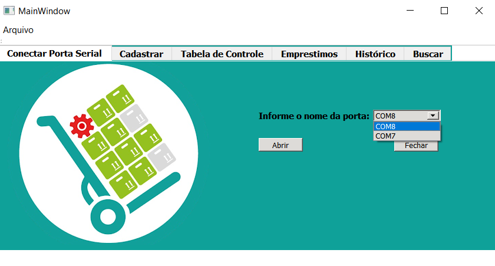

 
# Stock-Control 
Controle de Almoxarifado utilizando sensor RFID

Resumo: O Stock Control é um protótipo destinado a armazenamento de dados de objetos, podendo atuar em vários ambientes. Tem como principal objetivo o cadastro de itens, dos quais podem ser encontrados em um dos seguintes status: "Disponível" ou "Emprestado", sendo o item listado como "Disponível", ele pode ser encontrado no estoquue e facilmente ser emprestado a qualquer usuário. Após o empréstimo o programa armazena dados do usuário,tal como data de empréstimo e devolução, tendo assim o total domínio desses objetos.

# 1.Circuito

# 2.Interface QT  
A interface no Qt é onde acontece as principais funções do programa. Primeiramente o programa irá mostrar todas as portas seriais disponiveis para acesso, ao escolher a porta que conecta ao circuito o programa liberará ao usuário todas as outras funções, mas o usuário só terá acesso se a porta escolhida conectar com o circuito, caso não ocorra as outras funções permanecem bloqueadas.

 

Imagem 1: Acesso a portas

Após a conexão da porta o usuário terá que cadastrar cada item disponível através de Chips Mifare, eles podem estar contidos em cartões, tags, pulseiras, e mais uma infinidade de dispositivos, funcionam em distâncias de até 10cm e cada chip possui um código único usado para identificação. Após a aproximação do chip ao sensor a interface irá receber seu código, através da comunicação em formato JSON. Depois do código identificado, basta apenas escolher um nome para o objeto.

Imagem 2: Cadastro de Itens

Ainda no QT, os dispositivos serão armazenados em uma tabela, contendo: Nome,código e sua disponibilidade, inicialmente cada item recebe o status "Disponível".

Imagem 3: Tabela de itens cadastrados

Um empréstimo pode ser realizado facilmente, basta apenas aproximar ao sensor um chip já cadastrado, após isso basta apenas digitar o nome do usufruidor, então será criada outra tabela, contendo os dados da pessoa que realizou o empréstimo, além de armazenar as datas de empréstimo e devolução.

Imagem 4: Tabela de empréstimos

Caso o usuário precise buscar algum item, ele poderá ter uma opção de busca pelo nome do objeto, caso esse objeto seja encontrado ele será descrito em uma nova tabela na mesma aba de busca, essa tabela tem a opção de ser limpa, após a busca ser terminada.

Imagem 5: Busca

A interface também garante as opções de salvar ou abrir um arquivo de texto "csv". Essas funções são bastante úteis, visto que pode ter o armazenamento de dados salvo durante vários dias, sem haver a perda de informações durante o processo.

Imagem 6: Salvando dados

Imagem 7: Abrindo arquivos

# 3.Servidor Web
É por meio do Servidor Web que o usuário poderá verificar o estado do item desejado. Através do servidor Web é possível descobrir se o item está disponível ou indisponível para empréstimo. Dessa forma o usuário tem a total liberdade para pesquisar seu produto de qualquer lugar, bastando apenas saber o nome do que está à procura.

Imagem 8: Interface do Servidor Web
