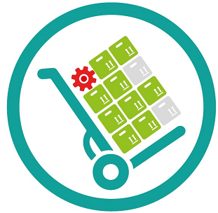

 
# Stock-Control 
Controle de Almoxarifado utilizando sensor RFID

Resumo: O Stock Control é um protótipo destinado a armazenamento de dados de objetos, podendo atuar em vários ambientes. Tem como principal objetivo o cadastro de itens, dos quais podem ser encontrados em um dos seguintes status : "Disponível" ou "Emprestado", sendo o item listado como "Disponivel", ele pode ser encontrado no estoquue e facilmente ser emprestado a qualquer usuário, após o empréstimo o programa armazena dados do usuário,tal como data de empréstimo e devolução,tendo assim o total domínio desses objetos.

# 1.Interface QT  
A interface no Qt é onde acontece as principais funções do programa. Primeiramente o programa irá mostrar todas as portas disponiveis para acesso, ao escolher a porta que conecta ao circuito o programa liberará ao usuário todas as outras funções, mas o usuário só terá acesso se a porta escolhida conectar com o circuito, caso não ocorra as outras funções permanecem bloqueadas.

Após a conexão da porta o usuário terá que cadastrar cada item disponivel através de Chips Mifare, eles podem estar contidos em cartões, tags, pulseiras, e mais uma infinidade de dispositivos, funcionam em distâncias de até 10cm e cada chip possui um código único usado para identificação. Após a aproximação do chip ao sensor a interface irá receber seu código, através da comunicação em formato JSON. Depois do código identificado, basta apenas escolher um nome para o objeto.

Ainda no QT, os dispositivos serão armazenados em uma tabela, contendo: Nome,código e sua disponibilidade, 
# 2.Web

